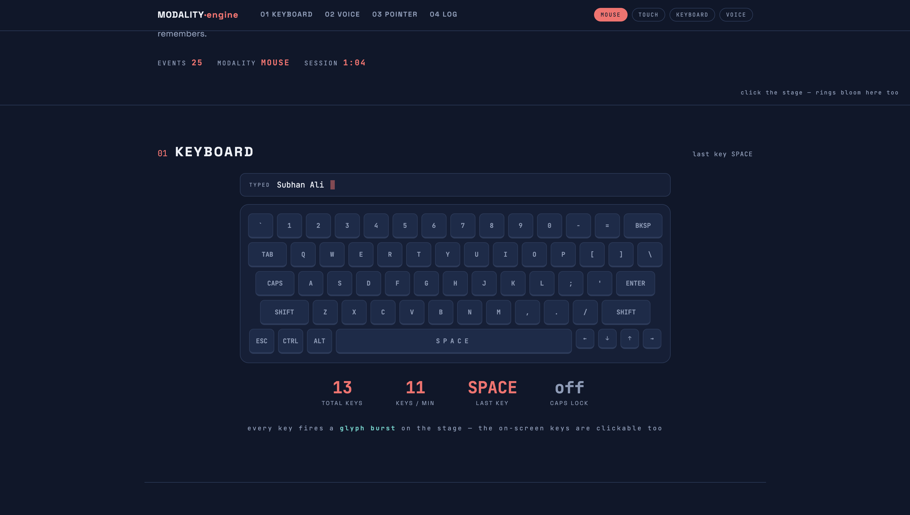
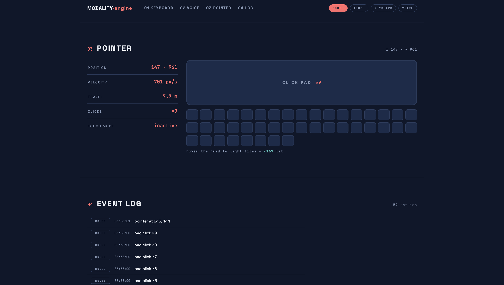

# MODALITY: Context-Aware Adaptive Multimodal UI Engine

An interactive Human-Computer Interaction (HCI) prototype and instrumentation testbed demonstrating **real-time multimodal input detection, cross-modality adaptation, and live interaction telemetry**. Built with zero external dependencies, the engine senses, processes, and adapts to four concurrent input channels: **Keyboard, Voice, Mouse/Pointer, and Touch**.

---

## Interface Previews

| Project 1: Sugar & Crumb UI | Project 2: MODALITY Engine |
| :---: | :---: |
|  |  |
| *Adaptive e-commerce customizer with direct manipulation gestures, synthesized voice output, and dynamic focus indicators* | *Interaction telemetry testbed with real-time audio FFT, physical/virtual keystroke monitoring, and pointer kinematics* |

---

## HCI Concepts & Architecture

### 1. Dynamic Modality Sensing & Ergonomic Adaptation
The system monitors low-level input signals and immediately transitions state to optimize ergonomics for the active channel:
- **Touch Channel:** Recognizes coarse touch contact, triggers `mode-touch`, and dynamically scales hit targets via CSS variables (`--uisc`) to satisfy **Fitts's Law** requirements.
- **Keyboard Channel:** Automatically switches focus indicators and highlights active modifier states (`CapsLock`, `Shift`) in an interactive on-screen keyboard.
- **Pointer Channel:** Tracks continuous kinematic metrics (velocity in px/s, travel distance in meters, and coordinates) with localized spatial feedback.
- **Voice Channel:** Integrates multilingual speech commands, speech transcript streaming, and a live Web Audio API waveform visualizer.

### 2. Interaction Telemetry & Visual Feedback Loops
- **Central Event Log:** Real-time chronological logging categorizing events across channels (`KEY`, `VOICE`, `MOUSE`, `TOUCH`, `SYS`).
- **Kinematic & Keystroke Tracking:** Live metrics monitoring keystrokes per minute (KPM), active session time, pointer displacement, and click density.
- **Canvas Interaction Stage:** Every input produces immediate audiovisual feedback through particle physics, ripple rings, and animated glyph launches.

---

## Modality Breakdown

| Channel | Input Mechanism | System Adaptation & Feedback |
| :--- | :--- | :--- |
| **Keyboard** | Physical keyboard or interactive on-screen keys | Virtual key flashing, typing buffer, real-time KPM counter, and Canvas glyph launches. |
| **Voice** | Web Speech API (`en-US`, `en-GB`, `ur-PK`, `es-ES`, `fr-FR`, `de-DE`) | Real-time Web Audio FFT visualizer, interim transcript streaming, and command execution. |
| **Pointer** | Mouse movement and stage clicks | Dynamic velocity calculation, travel distance measurement, ripple feedback pad, and hover tile grid. |
| **Touch** | Touchscreen taps and gestures | Enlarged button padding, expanded click pad dimensions, and UI scaling factor (`--uisc`). |

---

## Supported Voice Commands

The speech parsing pipeline processes natural spoken commands in **English** and **Urdu**:
- **Theme & Color Shift:** `"dark mode"`, `"light mode"`, `"teal"`, `"coral"`, `"amber"`, `"green"` (*"سبز / ہرا"*, *"نیلا"*, *"سرخ / لال"*, *"پیلا"*)
- **Target Resizing (Fitts's Law Scaling):** `"bigger"`, `"smaller"` (*"بڑا کرو"*, *"چھوٹا کرو"*)
- **Modality Hand-Off:** `"touch mode"`, `"mouse mode"`
- **Canvas Control:** `"burst"`, `"clear the stage"` (*"دھماکہ"*, *"صاف کرو"*)

---

## Technical Stack

- **Markup & Styling:** Semantic HTML5, CSS3 Custom Properties (Design Tokens), Responsive Typography (`clamp()`), and Hardware-Accelerated CSS Transitions.
- **Visualization:** Dual HTML5 Canvas engines:
  - Particle Physics & Text Glyph Engine (`requestAnimationFrame`).
  - Web Audio API FFT Spectrum Analyser (Byte frequency data bars).
- **APIs & Protocols:**
  - `Web Speech API` (`SpeechRecognition` / `webkitSpeechRecognition`)
  - `Web Audio API` (`AudioContext`, `AnalyserNode`, `MediaStreamAudioSourceNode`)
  - `IntersectionObserver API` (Scroll reveal transitions)
  - `PointerEvents` & `TouchEvents`
- **Architecture:** Zero-dependency, single-file deployment (`source.html`).

---

## Getting Started

### Prerequisites
- Modern Chromium-based browser (**Google Chrome** or **Microsoft Edge**) for native Web Speech Recognition and Web Audio access.
- Microphone access (required for voice recognition and live waveform rendering).

### Running Locally
To satisfy browser security policies for microphone permissions, serve the project files via an HTTP server:

```bash
# 1. Navigate to the project directory
cd modality-engine

# 2. Start a local HTTP server
python3 -m http.server 8000
